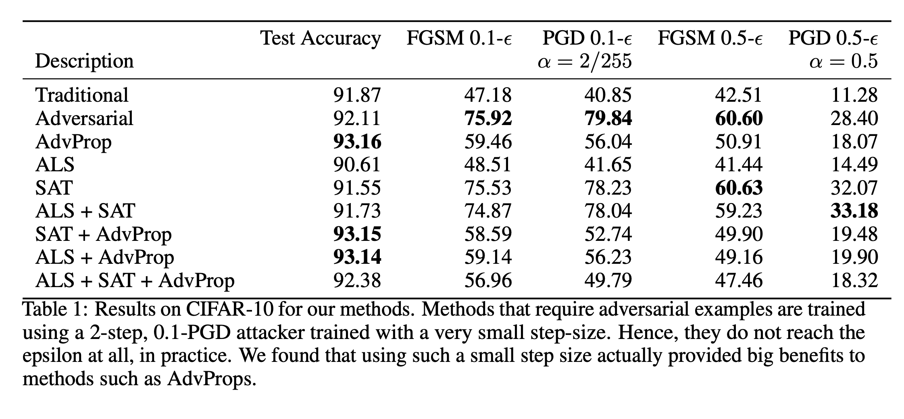
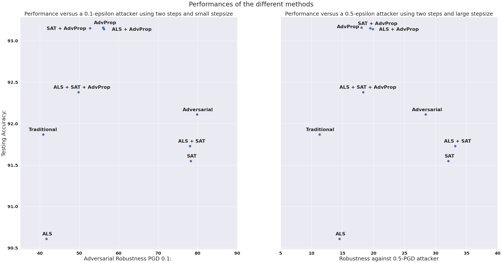

# Mixture of Techniques to Improve Classification Accuracy and Robustness with Adversarial Training

#### Project done by Martin Dallaire and François David 
###### For the class IFT-6756 Game Theory and Machine Learning, thought by Gauthier Gidel 

Results on the Cifar-10 Dataset


## In order to run the code, you have to run the following line 

```
python traininLoop.py description(string) epochs(int) adversarialTraining(bool) advProp(bool) als(bool) epsilon(float) alpha(float) path(string) npy_path(string) 
```

Here are a little bit more details about each parameters and their default values. 

* **description:** Description of the experiment. (Default: "Traditional Training") 
* **epochs:** Number of epochs you want to algorithm to train for. (Default: 100)
* **adversarialTraining:** If you want to train on adversarial images, must be true for advProp. (Default: False)
* **advProp:** If you want to train on adversarial images with auxiliary batch normalization layers, must be have adversarialTraining as true. (Default: False)
* **als:** If you want to train the smooth version of CE with the adversarial smoothing. (Default: False)
* **epsilon:** Perturbation range for the attacker. (Default: 0.1)
* **alpha:** Learning rate for the attacker. (Default: 2/255)
* **path:** path to save the model. (Default: "/saves/traditionalTraining")
* **npy_path:** path to save learning curves model. (Default: "traditionalTraining_")
